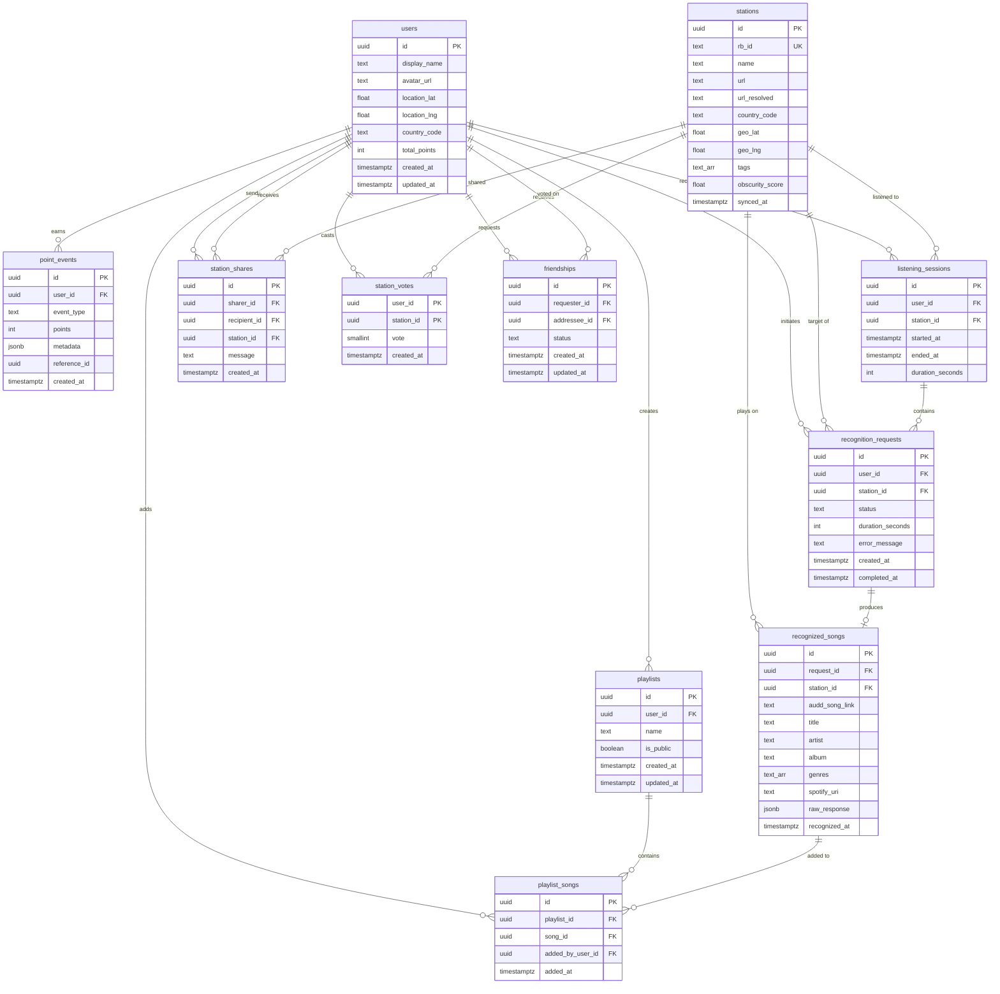

# Unearth Radio — Entity-Relationship Design

## 1. Overview

This document defines the database schema for **Unearth Radio**, a global radio discovery app with gamification. The database is designed for **Supabase (PostgreSQL)** with **Row Level Security (RLS)** enforced on all user-facing tables.

The schema supports the following domains:

- **User management** — profiles extending Supabase Auth, social connections
- **Radio station catalog** — synced from RadioBrowser API, enriched with local metadata
- **Song recognition** — async AudD-powered recognition pipeline with full track metadata
- **Playlists** — user-curated collections of recognized songs
- **Gamification** — point events, scoring for distance/obscurity/sharing/streaks
- **Social features** — friendships, station sharing, voting
- **Analytics** — listening session tracking for dashboard stats

---

## 2. Entity-Relationship Diagram

---

## 3. Core Entities

### 3.1 `users`

Extends Supabase `auth.users`. Stores public profile data and gamification totals.

| Column | Type | Constraints | Description |
|---|---|---|---|
| `id` | `uuid` | `PRIMARY KEY`, references `auth.users(id)` | Supabase Auth user ID |
| `display_name` | `text` | `NOT NULL` | Public display name |
| `avatar_url` | `text` | nullable | Profile image URL |
| `location_lat` | `double precision` | nullable | User's latitude for distance-based scoring |
| `location_lng` | `double precision` | nullable | User's longitude for distance-based scoring |
| `country_code` | `text` | nullable | ISO 3166-1 alpha-2 country code |
| `total_points` | `integer` | `NOT NULL`, `DEFAULT 0` | Cached total gamification points |
| `preferences` | `jsonb` | `NOT NULL`, `DEFAULT '{}'` | User preferences: genre defaults, notification opt-ins, theme, etc. |
| `created_at` | `timestamptz` | `NOT NULL`, `DEFAULT now()` | Profile creation timestamp |
| `updated_at` | `timestamptz` | `NOT NULL`, `DEFAULT now()` | Last profile update |

---

### 3.2 `stations`

Radio station catalog synced from the RadioBrowser API. Enriched with local fields like `obscurity_score`.

| Column | Type | Constraints | Description |
|---|---|---|---|
| `id` | `uuid` | `PRIMARY KEY`, `DEFAULT gen_random_uuid()` | Internal station ID |
| `rb_id` | `text` | `UNIQUE`, `NOT NULL` | RadioBrowser station UUID |
| `name` | `text` | `NOT NULL` | Station display name |
| `url` | `text` | `NOT NULL` | Original stream URL |
| `url_resolved` | `text` | nullable | Resolved/redirected stream URL |
| `homepage` | `text` | nullable | Station homepage URL |
| `favicon` | `text` | nullable | Station icon URL |
| `country` | `text` | nullable | Country name |
| `country_code` | `text` | nullable | ISO 3166-1 alpha-2 country code |
| `state` | `text` | nullable | State/region within country |
| `geo_lat` | `double precision` | nullable | Station latitude (for display) |
| `geo_lng` | `double precision` | nullable | Station longitude (for display) |
| `geo` | `geography(Point, 4326)` | nullable | PostGIS geography point for spatial queries (`ST_Distance`, `ST_DWithin`) |
| `tags` | `text[]` | `DEFAULT '{}'` | Genre tags, e.g. `['rock', 'pop']` |
| `language` | `text[]` | `DEFAULT '{}'` | Broadcast languages |
| `codec` | `text` | nullable | Audio codec, e.g. `'MP3'` |
| `bitrate` | `integer` | nullable | Stream bitrate in kbps |
| `votes` | `integer` | `DEFAULT 0` | Vote count from RadioBrowser |
| `click_count` | `integer` | `DEFAULT 0` | Click count from RadioBrowser |
| `click_trend` | `integer` | `DEFAULT 0` | Click trend from RadioBrowser |
| `obscurity_score` | `double precision` | nullable | Pre-computed gamification score (lower votes/clicks = higher score) |
| `hls` | `boolean` | `DEFAULT false` | Whether stream is HLS |
| `last_check_ok` | `boolean` | `DEFAULT true` | Whether last health check passed |
| `last_check_ok_time` | `timestamptz` | nullable | Timestamp of last successful health check |
| `synced_at` | `timestamptz` | `NOT NULL`, `DEFAULT now()` | Last sync from RadioBrowser |
| `created_at` | `timestamptz` | `NOT NULL`, `DEFAULT now()` | Row creation timestamp |

---

### 3.3 `recognition_requests`

Tracks each song recognition attempt. One request per AudD lookup.

| Column | Type | Constraints | Description |
|---|---|---|---|
| `id` | `uuid` | `PRIMARY KEY`, `DEFAULT gen_random_uuid()` | Request ID |
| `user_id` | `uuid` | `NOT NULL`, FK → `users(id)` | User who initiated the recognition |
| `station_id` | `uuid` | `NOT NULL`, FK → `stations(id)` | Station being listened to |
| `session_id` | `uuid` | nullable, FK → `listening_sessions(id)` | The listening session during which this recognition was triggered |
| `status` | `text` | `NOT NULL`, `DEFAULT 'pending'` | Pipeline status: `'pending'`, `'processing'`, `'completed'`, `'failed'`, `'no_match'` |
| `duration_seconds` | `integer` | `DEFAULT 10` | Audio capture duration in seconds |
| `error_message` | `text` | nullable | Error details if status is `'failed'` |
| `created_at` | `timestamptz` | `NOT NULL`, `DEFAULT now()` | When the request was created |
| `completed_at` | `timestamptz` | nullable | When recognition finished |

---

### 3.4 `recognized_songs`

Stores the result of a successful song recognition. One-to-one with `recognition_requests`.

| Column | Type | Constraints | Description |
|---|---|---|---|
| `id` | `uuid` | `PRIMARY KEY`, `DEFAULT gen_random_uuid()` | Song record ID |
| `request_id` | `uuid` | `UNIQUE`, `NOT NULL`, FK → `recognition_requests(id)` | Originating recognition request (1:1) |
| `station_id` | `uuid` | `NOT NULL`, FK → `stations(id)` | Station the song was playing on |
| `audd_song_link` | `text` | `NOT NULL` | AudD song link identifier (lis.tn URL) |
| `title` | `text` | `NOT NULL` | Song title |
| `artist` | `text` | `NOT NULL` | Artist name |
| `album` | `text` | nullable | Album name |
| `album_art_url` | `text` | nullable | Album artwork URL |
| `genres` | `text[]` | `DEFAULT '{}'` | Genre tags from recognition API |
| `isrc` | `text` | nullable | International Standard Recording Code |
| `release_year` | `integer` | nullable | Year of release |
| `spotify_uri` | `text` | nullable | Spotify track URI, e.g. `spotify:track:xxx` |
| `apple_music_url` | `text` | nullable | Apple Music track URL |
| `deezer_url` | `text` | nullable | Deezer track URL |
| `shazam_url` | `text` | nullable | Song page URL (lis.tn) |
| `preview_url` | `text` | nullable | Audio preview URL (~30s clip) |
| `lyrics_snippet` | `text` | nullable | Short lyrics excerpt if available |
| `raw_response` | `jsonb` | nullable | Full AudD API response for future use |
| `recognized_at` | `timestamptz` | `NOT NULL`, `DEFAULT now()` | When the song was recognized |

---

### 3.5 `playlists`

User-created collections of recognized songs. Can be public or private.

| Column | Type | Constraints | Description |
|---|---|---|---|
| `id` | `uuid` | `PRIMARY KEY`, `DEFAULT gen_random_uuid()` | Playlist ID |
| `user_id` | `uuid` | `NOT NULL`, FK → `users(id)` | Playlist owner |
| `name` | `text` | `NOT NULL` | Playlist name |
| `description` | `text` | nullable | Optional description |
| `is_public` | `boolean` | `DEFAULT false` | Whether the playlist is publicly visible |
| `cover_image_url` | `text` | nullable | Custom cover image URL |
| `created_at` | `timestamptz` | `NOT NULL`, `DEFAULT now()` | Creation timestamp |
| `updated_at` | `timestamptz` | `NOT NULL`, `DEFAULT now()` | Last modification timestamp |

---

### 3.6 `playlist_songs`

Junction table linking playlists to recognized songs.

| Column | Type | Constraints | Description |
|---|---|---|---|
| `id` | `uuid` | `PRIMARY KEY`, `DEFAULT gen_random_uuid()` | Row ID |
| `playlist_id` | `uuid` | `NOT NULL`, FK → `playlists(id)` `ON DELETE CASCADE` | Parent playlist |
| `song_id` | `uuid` | `NOT NULL`, FK → `recognized_songs(id)` | Referenced song |
| `added_at` | `timestamptz` | `NOT NULL`, `DEFAULT now()` | When the song was added |
| `added_by_user_id` | `uuid` | FK → `users(id)` | User who added the song (relevant for shared playlists) |

**Constraints:**

- `UNIQUE(playlist_id, song_id)` — prevent duplicate songs in a playlist

---

### 3.7 `point_events`

Immutable audit log for all gamification point transactions.

| Column | Type | Constraints | Description |
|---|---|---|---|
| `id` | `uuid` | `PRIMARY KEY`, `DEFAULT gen_random_uuid()` | Event ID |
| `user_id` | `uuid` | `NOT NULL`, FK → `users(id)` | User who earned/lost points |
| `event_type` | `text` | `NOT NULL` | Type: `'discovery'`, `'distance_bonus'`, `'obscurity_bonus'`, `'share'`, `'vote'`, `'streak'`, `'achievement'` |
| `points` | `integer` | `NOT NULL` | Points awarded (negative for deductions) |
| `metadata` | `jsonb` | nullable | Flexible context, e.g. `{"station_id": "...", "distance_km": 4200, "obscurity_score": 0.87}` |
| `reference_id` | `uuid` | nullable | FK to the entity that triggered this event (song, share, vote, etc.) |
| `created_at` | `timestamptz` | `NOT NULL`, `DEFAULT now()` | When the event occurred |

---

### 3.8 `friendships`

Directional friendship pairs with status tracking.

| Column | Type | Constraints | Description |
|---|---|---|---|
| `id` | `uuid` | `PRIMARY KEY`, `DEFAULT gen_random_uuid()` | Friendship record ID |
| `requester_id` | `uuid` | `NOT NULL`, FK → `users(id)` | User who sent the friend request |
| `addressee_id` | `uuid` | `NOT NULL`, FK → `users(id)` | User who received the request |
| `status` | `text` | `NOT NULL`, `DEFAULT 'pending'` | Status: `'pending'`, `'accepted'`, `'declined'`, `'blocked'` |
| `created_at` | `timestamptz` | `NOT NULL`, `DEFAULT now()` | When the request was sent |
| `updated_at` | `timestamptz` | `NOT NULL`, `DEFAULT now()` | Last status change |

**Constraints:**

- `UNIQUE(requester_id, addressee_id)` — one request per direction per pair
- `CHECK(requester_id != addressee_id)` — prevent self-friending

---

### 3.9 `station_shares`

Records of users sharing stations with friends.

| Column | Type | Constraints | Description |
|---|---|---|---|
| `id` | `uuid` | `PRIMARY KEY`, `DEFAULT gen_random_uuid()` | Share record ID |
| `sharer_id` | `uuid` | `NOT NULL`, FK → `users(id)` | User who shared the station |
| `recipient_id` | `uuid` | `NOT NULL`, FK → `users(id)` | User who received the share |
| `station_id` | `uuid` | `NOT NULL`, FK → `stations(id)` | Station being shared |
| `message` | `text` | nullable | Optional message with the share |
| `created_at` | `timestamptz` | `NOT NULL`, `DEFAULT now()` | When the share was sent |

---

### 3.10 `station_votes`

User votes on stations. Composite primary key ensures one vote per user per station.

| Column | Type | Constraints | Description |
|---|---|---|---|
| `user_id` | `uuid` | `NOT NULL`, FK → `users(id)` | Voting user |
| `station_id` | `uuid` | `NOT NULL`, FK → `stations(id)` | Station being voted on |
| `vote` | `smallint` | `NOT NULL` | `1` (upvote) or `-1` (downvote) |
| `created_at` | `timestamptz` | `NOT NULL`, `DEFAULT now()` | When the vote was cast |

**Constraints:**

- `PRIMARY KEY(user_id, station_id)` — one vote per user per station

---

### 3.11 `listening_sessions`

Tracks when and how long users listen to stations. Powers the analytics dashboard.

| Column | Type | Constraints | Description |
|---|---|---|---|
| `id` | `uuid` | `PRIMARY KEY`, `DEFAULT gen_random_uuid()` | Session ID |
| `user_id` | `uuid` | `NOT NULL`, FK → `users(id)` | Listening user |
| `station_id` | `uuid` | `NOT NULL`, FK → `stations(id)` | Station being listened to |
| `started_at` | `timestamptz` | `NOT NULL`, `DEFAULT now()` | Session start time |
| `ended_at` | `timestamptz` | nullable | Session end time (null while active) |
| `duration_seconds` | `integer` | nullable | Computed duration (`ended_at - started_at`), set on session end |

---

## 4. Relationships

### User-centric

- A **user** has many **playlists** (one-to-many)
- A **user** has many **recognition_requests** (one-to-many)
- A **user** has many **point_events** (one-to-many)
- A **user** has many **listening_sessions** (one-to-many)
- A **user** has many **station_votes** (one-to-many)
- A **user** can send and receive many **station_shares** (one-to-many on both `sharer_id` and `recipient_id`)
- A **user** can send and receive many **friendships** (one-to-many on both `requester_id` and `addressee_id`)

### Station-centric

- A **station** has many **recognition_requests** targeting it (one-to-many)
- A **station** has many **recognized_songs** found on it (one-to-many, via `recognized_songs.station_id`)
- A **station** has many **station_votes** (one-to-many)
- A **station** has many **listening_sessions** (one-to-many)
- A **station** has many **station_shares** (one-to-many)

### Recognition pipeline

- A **recognition_request** produces zero or one **recognized_song** (one-to-one; `recognized_songs.request_id` is `UNIQUE`)
- This models the case where recognition can fail or find no match, resulting in no song record

### Playlists

- A **playlist** contains many **recognized_songs** through the **playlist_songs** junction table (many-to-many)
- A recognized song can appear in multiple playlists

### Gamification

- **point_events** reference a **user** (mandatory) and optionally link to the entity that triggered them via `reference_id` (polymorphic FK)
- `users.total_points` is a cached aggregate of `point_events.points` for that user

### Social

- **Friendships** are stored as directional pairs with a `status` field. A mutual friendship exists when status is `'accepted'`. The `UNIQUE(requester_id, addressee_id)` constraint prevents duplicate requests in the same direction.

---

## 5. Indexes

### `stations`

| Index | Type | Rationale |
|---|---|---|
| `idx_stations_tags` | `GIN` on `tags` | Fast genre/tag filtering with `@>` and `&&` operators |
| `idx_stations_country_code` | `btree` on `country_code` | Filter stations by country |
| `idx_stations_obscurity_score` | `btree` on `obscurity_score` | Sort/filter by obscurity for gamification |
| `idx_stations_geo` | `GIST` on `geo` | Spatial index for `ST_Distance` and `ST_DWithin` distance queries (PostGIS) |

### `recognition_requests`

| Index | Type | Rationale |
|---|---|---|
| `idx_recognition_requests_user_created` | `btree` on `(user_id, created_at)` | User's recognition history, sorted by time |
| `idx_recognition_requests_status` | `btree` on `status` | Worker queue: find pending/processing requests |

### `recognized_songs`

| Index | Type | Rationale |
|---|---|---|
| `idx_recognized_songs_station_id` | `btree` on `station_id` | Find all songs recognized on a station |
| `idx_recognized_songs_audd_song_link` | `btree` on `audd_song_link` | Deduplicate or look up by AudD ID |
| `idx_recognized_songs_artist` | `btree` on `artist` | Search/filter by artist |

### `point_events`

| Index | Type | Rationale |
|---|---|---|
| `idx_point_events_user_created` | `btree` on `(user_id, created_at)` | User's point history timeline |
| `idx_point_events_event_type` | `btree` on `event_type` | Filter/aggregate by event type |

### `listening_sessions`

| Index | Type | Rationale |
|---|---|---|
| `idx_listening_sessions_user_started` | `btree` on `(user_id, started_at)` | User's listening history for dashboard |

### `friendships`

| Index | Type | Rationale |
|---|---|---|
| `idx_friendships_addressee_id` | `btree` on `addressee_id` | Find incoming friend requests (`requester_id` is already covered by the `UNIQUE` constraint) |

### `playlist_songs`

| Index | Type | Rationale |
|---|---|---|
| `idx_playlist_songs_song_id` | `btree` on `song_id` | Find all playlists containing a specific song |

---

## 6. Row Level Security (RLS)

All tables below should have RLS **enabled**. Policies are applied per table.

### `users`

| Operation | Policy |
|---|---|
| `SELECT` | Users can read their own profile. Authenticated users can read other users' `id`, `display_name`, `avatar_url`, `total_points` (public fields). |
| `INSERT` | Triggered by auth signup hook only (service role). |
| `UPDATE` | Users can update their own profile only (`auth.uid() = id`). |
| `DELETE` | Service role only (account deletion flow). |

### `stations`

| Operation | Policy |
|---|---|
| `SELECT` | All authenticated users can read all stations. |
| `INSERT` / `UPDATE` / `DELETE` | Service role only (sync job from RadioBrowser). |

### `recognition_requests`

| Operation | Policy |
|---|---|
| `SELECT` | Users can read their own requests (`auth.uid() = user_id`). |
| `INSERT` | Authenticated users can create requests for themselves (`auth.uid() = user_id`). |
| `UPDATE` / `DELETE` | Service role only (worker updates status). |

### `recognized_songs`

| Operation | Policy |
|---|---|
| `SELECT` | Users can read songs from their own requests. Public playlist songs are readable by all authenticated users. |
| `INSERT` / `UPDATE` / `DELETE` | Service role only (written by recognition worker). |

### `playlists`

| Operation | Policy |
|---|---|
| `SELECT` | Owner can read all their playlists. Public playlists (`is_public = true`) are readable by all authenticated users. |
| `INSERT` | Authenticated users can create playlists for themselves. |
| `UPDATE` / `DELETE` | Owner only (`auth.uid() = user_id`). |

### `playlist_songs`

| Operation | Policy |
|---|---|
| `SELECT` | Readable if the parent playlist is owned by the user or is public. |
| `INSERT` / `DELETE` | Playlist owner only. |

### `point_events`

| Operation | Policy |
|---|---|
| `SELECT` | Users can read their own point events. Leaderboard is a separate read-only view/function aggregating `total_points` from `users`. |
| `INSERT` / `UPDATE` / `DELETE` | Service role only (points are awarded by server-side logic). |

### `friendships`

| Operation | Policy |
|---|---|
| `SELECT` | Both `requester_id` and `addressee_id` can read the record. |
| `INSERT` | Authenticated users can create requests where `auth.uid() = requester_id`. |
| `UPDATE` | Addressee can accept/decline (`auth.uid() = addressee_id` and current status is `'pending'`). Requester can cancel pending requests. |
| `DELETE` | Either party can delete (unfriend). |

### `station_shares`

| Operation | Policy |
|---|---|
| `SELECT` | Sharer and recipient can both read (`auth.uid() IN (sharer_id, recipient_id)`). |
| `INSERT` | Authenticated users can create shares where `auth.uid() = sharer_id`. |
| `DELETE` | Sharer can delete their own shares. |

### `station_votes`

| Operation | Policy |
|---|---|
| `SELECT` | Users can read their own votes. Aggregate counts are public via a view. |
| `INSERT` / `UPDATE` | Authenticated users can manage their own votes (`auth.uid() = user_id`). |
| `DELETE` | Users can remove their own votes. |

### `listening_sessions`

| Operation | Policy |
|---|---|
| `SELECT` | Users can read their own sessions (`auth.uid() = user_id`). |
| `INSERT` | Authenticated users can create sessions for themselves. |
| `UPDATE` | Users can update their own active sessions (set `ended_at`). |
| `DELETE` | Service role only. |

---

## 7. Open Schema Questions — All Resolved ✅

> All schema decisions have been resolved. Decisions are documented below for reference.

1. ~~**Artist/Album normalization**~~ ✅ RESOLVED — **Keep denormalized.** Artist and album are stored as plain text on `recognized_songs`. AudD returns these as strings with no canonical ID, so normalization would require fuzzy matching or MusicBrainz lookups — unnecessary complexity at this stage. ISRC serves as the natural deduplication key for song recordings. Aggregation queries like "most recognized artists" work fine with `GROUP BY artist` at our expected scale. Revisit if we build artist profile pages (P2+).

2. ~~**Achievements / Badges table**~~ ✅ RESOLVED — **Deferred to P1.** MVP gamification is points-only, fully covered by `point_events` + `users.total_points`. Achievement tables will be added in P1 when the achievement system is designed, using real user behavior data to inform which milestones make sense. Planned schema: `achievements(id, slug, name, description, icon_url, criteria_type, criteria_value)` + `user_achievements(user_id, achievement_id, unlocked_at)`.

3. ~~**Session → Song linking**~~ ✅ RESOLVED — **Add `session_id` FK on `recognition_requests`.** A nullable `session_id uuid FK → listening_sessions(id)` column is added to `recognition_requests`. This cleanly links recognitions to the session in which they occurred, enabling dashboard features like "3 songs recognized during this session" without extra tables. Nullable to handle edge cases where recognition is triggered outside a tracked session.

4. ~~**PostGIS vs. Haversine**~~ ✅ RESOLVED — **PostGIS.** Distance-based scoring is a core P1 feature and computing distances in application code doesn't scale. PostGIS is a first-class Supabase extension (enabled with one click, no operational overhead). Station coordinates are stored as `geography(Point, 4326)` with a `GIST` index alongside `geo_lat`/`geo_lng` floats (kept for display). `ST_Distance` and `ST_DWithin` power distance scoring and "stations near me" queries in a single SQL call.

5. ~~**User preferences table**~~ ✅ RESOLVED — **`jsonb` column on `users`.** A `preferences jsonb DEFAULT '{}'` column is added to the `users` table. At MVP, preferences are a small flat set of values (genre defaults, notification opt-ins, theme) that don't warrant a separate table. The flexible schema means new preference keys can be added without migrations. Migrate to a dedicated table if preferences grow complex enough to need indexing or row-level granularity.
